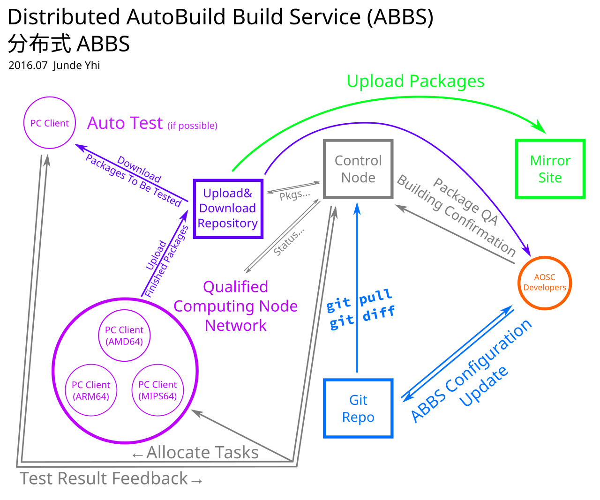

# Distributed AutoBuild Build Service (ABBS)

An implementation of a distributed automatic software package building & testing system, for AOSC OS's building system ABBS.

## What's it?

[Autobuild Build Service](https://github.com/AOSC-Dev/abbs) and its backend [Autobuild](https://github.com/AOSC-Dev/autobuild3) is the software packaging tool developed by [Anthon Open Source Community (AOSC)](https://aosc.io). They make building software packages for AOSC OS, which is the Linux distribution project of AOSC, easier. However, as time goes on, we are aware that the bottleneck of the speed to build AOSC OS is the lack of **computing power**. Distributed architecture can solve this problem.

## How it works?

We designed a [BOINC](http://boinc.berkeley.edu/)-like distributed grid computing network. See [the graph](distributed-abbs-vectorized) for straightforward details.

- AOSC OS packagers first write ABBS and autobuild configuration files and commit them into the main [aosc-os-abbs repository](https://github.com/AOSC-Dev/aosc-os-abbs).
- A control node is set to monitor the status of the upstream git repository (as for the particular server software TBD). As soon as there're commits, it will `git pull` and `git diff` them to compute **which packages should be built**.
- Several PC clients should be ready to receive tasks allocated by the control node. They need a client software to do this (as for the particular client software TBD). If there're, the control node will allocate some tasks (number of tasks depends on the client settings, see also BOINC client) to the PC.
- The client PC should have one AOSC OS Buildkit avaliable, either in `.tar.xz` or Docker format. The client software will use `systemd-nspawn` or `docker` to new a container. The container will execute these tasks in order:
  - `git pull` or `git clone --depth=1` the aosc-os-abbs repository
  - `abbs-build package_name`
  - Upload finished packages to AOSC server (it may be the control node or aother Upload & Download server)
- Control node will notify AOSC developers that some packages have been built successfully. Then, AOSC developers can fetch these packages from the control node (or the upload & download server) and test if software works.
  - Some software contains auto testing framework. If possible, another PC client can be allocated to test a software by running the automatic testing tools.
- After QA passed, AOSC developers can mark packages "Good". Once the control node received such message, it will upload, or order the upload & download server to upload, the passed packages to main mirror.

## License

All files are licensed under [CC-BY-SA 4.0 International](http://creativecommons.org/licenses/by-sa/4.0/).
